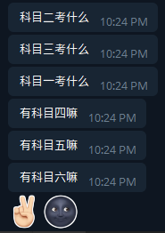

科目 n
======

A replica of the lord of the world.

Hosted on [https://brined.fish/kemu/](https://brined.fish/kemu/)

API
---

POST any integer number (within the range of uint32) to [https://brined.fish/kemu/](https://brined.fish/kemu/).
